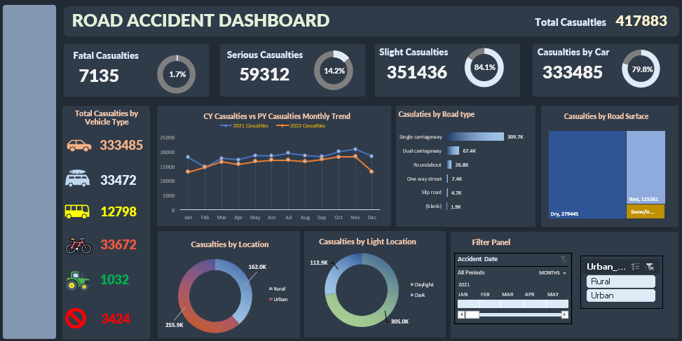
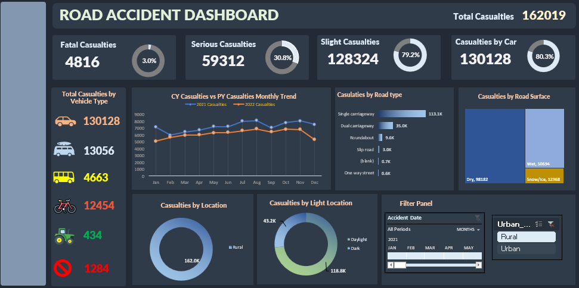
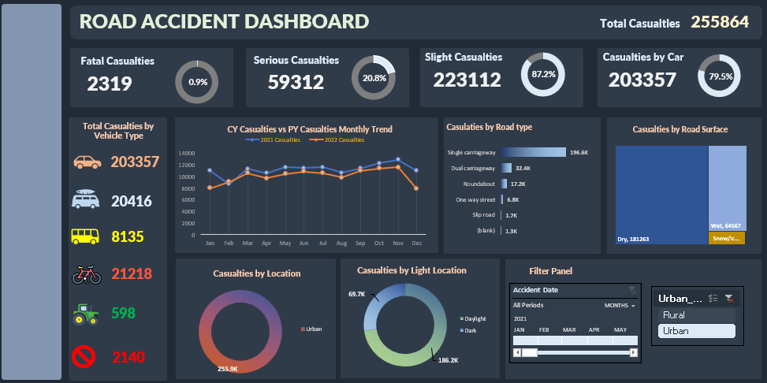
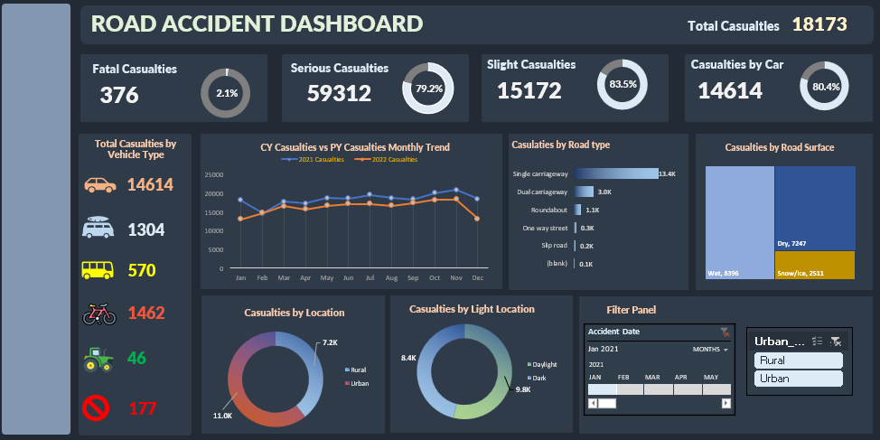
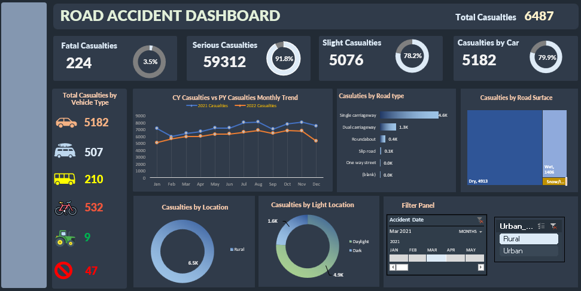

# 🚦 Road Accident Dashboard (Excel)

## 📌 Project Overview
This project presents a dashboard-based analysis of road accident data created using Microsoft Excel. The focus is on visually summarizing accident trends, severity distribution, and key KPIs in a clear and decision-friendly format.

The repository shares dashboard visuals only to ensure quick understanding and consistent viewing across devices.

---
## 🛠 Tools Used
- Microsoft Excel  
- Pivot Tables  
- Pivot Charts  
- Excel Dashboard Design  

---
## 📊 Dashboard Highlights
- Total accident KPIs  
- Severity-wise accident distribution  
- Year-wise accident trends  
- Visual summaries using charts and slicers  

---
## 📷 Dashboard Preview

### Overall Dashboard View

### Rural Accidents View

### Urban Accidents View

### January 2021 Accidents

### Rural Accidents – March 2021

---
## 🎯 Objective
To design a clean and informative Excel dashboard that transforms accident data into meaningful insights suitable for MIS reporting and analytical review.

---
## 📂 Note on Project Files
This repository intentionally includes dashboard visuals only.  
The complete Excel workbook can be shared separately if required.

